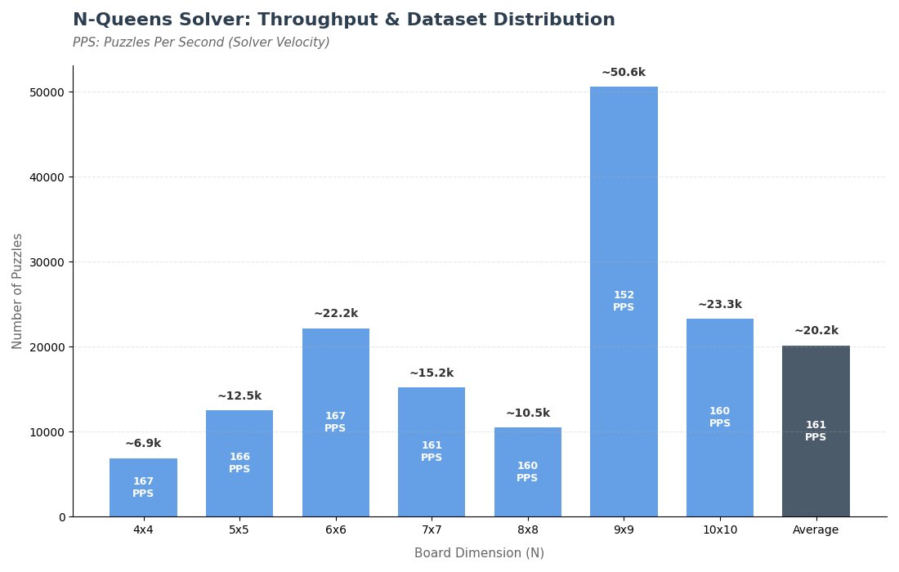

# LinkedIn N-Queens CP Solver

A high-performance **Constraint Programming (CP)** solver designed for high-throughput solution discovery. This engine was built to solve N-Queens puzzles while maintaining stable velocity across increasing board complexities.

[](https://www.kaggle.com/datasets/pedroacurciodomingos/queens-puzzle-collection/data)
[](https://www.kaggle.com/datasets/pedroacurciodomingos/queens-puzzle-collection-2-140k-puzzles/data)

## ♟️ **LinkedIn Queens: A Variation on the N-Queens Puzzle**

In the LinkedIn version of the N-Queens problem, the goal is to place $N$ queens on an $N \times N$ grid according to three primary constraints:

1.  **Row & Column:** Each row and column must contain exactly one queen.
2.  **Color Regions:** The board is divided into distinct colored regions; each color must contain exactly one queen.
3.  **Adjacency (No-Touching):** Unlike standard chess, queens do not attack along full diagonals. However, **no two queens can be adjacent**—horizontally, vertically, or diagonally (they cannot occupy any of the 8 cells immediately surrounding another queen).

## 🚀 Highlights

- **Total Dataset:** 141,168 unique, single-solution puzzles.
- **Average Solver Throughput:** **161 PPS** (Puzzles Per Second).
- **Range:** 4x4 to 10x10 boards.
- **Stability:** Optimized logic ensures performance remains stable as board dimensions increase.

| Board Size    | Puzzle Count | Avg. Velocity |
| :------------ | :----------- | :------------ |
| 4x4           | ~6.9k        | 167 PPS       |
| 5x5           | ~12.5k       | 166 PPS       |
| 6x6           | ~22.1k       | 167 PPS       |
| 7x7           | ~15.2k       | 161 PPS       |
| 8x8           | ~10.4k       | 160 PPS       |
| 9x9           | ~50.6k       | 152 PPS       |
| 10x10         | ~23.2k       | 160 PPS       |
| **Total/Avg** | **141,168**  | **161 PPS**   |

### Benchmark Analysis


_Figure 1: Comparison of Dataset Volume vs. Solver Velocity (PPS: Puzzles Per Second)._

---

## 📂 The Datasets

The datasets developed during the building and testing of this solver are both hosted on Kaggle. They are designed for machine learning, algorithmic benchmarking, and constraint-satisfaction research. Feel free to test new techniques to either solve puzzles in less time or to tackle larger boards.

**Download the data here:**  
🔗 **[300+ Queens Puzzle Collection on Kaggle](https://www.kaggle.com/datasets/pedroacurciodomingos/queens-puzzle-collection/data)**
🔗 **[140k+ Queens Puzzle Collection 2 on Kaggle](https://www.kaggle.com/datasets/pedroacurciodomingos/queens-puzzle-collection-2-140k-puzzles/data)**

---

## 🚀 Getting Started

### Prerequisites

- Python 3.x
- pychoco: The Constraint Programming solver engine.
- tqdm: Progress bar for processing multiple puzzles.
- Pillow (PIL): Used for generating and saving board images.

### Installation

Library Install

```bash
pip install pychoco tqdm Pillow
```

Project Download

```bash
git clone https://github.com/DrakoonsDaxter/LinkedIn-N-Queens-CP-Solver.git
```

### Running the solver

Base Setup:

```python
import time
from pathlib import Path

# Output dir
OUTPUT_DIR = Path("./outputs")
OUTPUT_DIR.mkdir(parents=True, exist_ok=True)

# Execution:
INPUT_DIR = Path("./puzzles/puzzle_text/problems") # Directory containing the problem text files

save = False # If you want to save the solution found
measure_time = True # If you want to measure the time it took to find all the solutions for each puzzle

if measure_time:
    import time
    start_time = time.time()
```

Single Puzzle Example Usage:

```python
PUZZLE_NUMBER = 1 # The desired puzzle number
PUZZLE_PATH = INPUT_DIR / f"{PUZZLE_NUMBER}.txt"
single_puzzle_solve(PUZZLE_PATH, output_image_path=OUTPUT_DIR / f"{PUZZLE_NUMBER}.png", output_text_path=OUTPUT_DIR / f"{PUZZLE_NUMBER}.txt", save=save, verbose=True)
```

Multiple Puzzle Example Usage:

```python
SIZE_N = 4 # The desired puzzle size folder
PUZZLE_DIR = INPUT_DIR / f"{SIZE_N}x{SIZE_N}"
all_puzzles_solve(PUZZLE_DIR, output_image_path=OUTPUT_DIR, output_text_path=OUTPUT_DIR, save=save, verbose=False)
```

Final Measure Time Print:

```python
if measure_time:
    end_time = time.time()
    print(f"Total execution time: {end_time - start_time:.2f} seconds")
```
